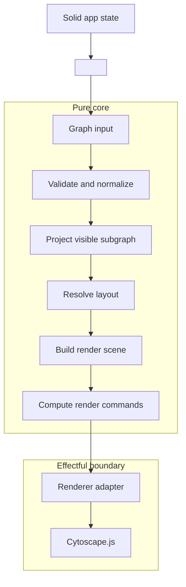
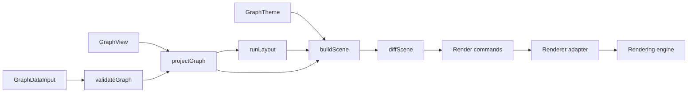

# Architecture

This document describes the target architecture for `munchkeen`.

`munchkeen` is a Solid-first interactive graph exploration toolkit. Its job is to take graph data, derive the subgraph a user should currently see, arrange it meaningfully, and render it through a concrete backend.

In v1, Cytoscape.js is the first renderer adapter and the first production implementation of that model.

Just as importantly, the implementation should favor functional programming principles in the core:

- immutable values
- explicit transformation stages
- explicit state transitions
- explicit error handling
- side effects isolated at the boundary

## Product Shape

`munchkeen` is built for graph exploration experiences such as:

- focusing a node and showing its neighborhood
- filtering and traversing a large graph
- switching between different projections of the same graph
- applying semantic layouts and themes
- driving graph interactions from Solid state

The central abstraction is:

```text
graph -> projection -> layout -> scene -> renderer
```

The implementation stance is:

```text
immutable values -> pure transforms -> render commands -> effect interpreter
```

These two lines together describe the architecture more accurately than any individual module name.

## Functional Orientation

The architecture should be read through two lenses at the same time.

### Product lens

The library helps applications explore graphs.

### Implementation lens

The library should prefer:

- pure functions in the core
- data-first modeling
- algebraic data types where they reduce invalid states
- deterministic transforms
- explicit effect boundaries

This does not require the consumer-facing API to look academic or heavily FP-flavored. It means the internal implementation should maximize predictability.

Where internal FP primitives are needed, their naming and meaning should follow Haskell-friendly FP conventions rather than project-local alternatives:

- `Thunk<A>`
- `Maybe<A>`
- `Either<E, A>`
- `IO<A>`
- `ReadonlyNonEmptyArray<A>`

Within that vocabulary:

- `Thunk<A>` represents a suspended synchronous computation in the most general sense
- `IO<A>` is a semantic effect type built on top of suspended synchronous computation
- `Right` represents success
- `Left` represents failure

Async effects should remain an explicit design choice rather than being prematurely collapsed into a generic internal `Task` abstraction.
In v1, async work may remain adapter-local unless the core develops a concrete need for a shared abstraction.

## Core Ideas

### Graphs are values

Application code should describe nodes and edges in domain terms rather than in renderer-specific formats. Graphs should be treated as immutable values, not as mutable engine-owned objects.

### Projection is part of the product

Exploration interfaces rarely show the entire graph at once. They usually show a visible subgraph derived from:

- focus
- neighborhood depth
- selection
- filters
- expansion state

This projection step is one of the main values the library provides.

### The core is a transformation pipeline

The core should primarily transform one immutable graph-shaped value into another:

- input graph
- validated graph
- projected graph
- laid-out graph
- render scene

Each stage should have a clear input and output type.

### Renderers interpret, they do not define

Renderers should consume graph semantics that have already been resolved by the core. They draw, animate, and interact with a scene. They do not define the canonical graph model.

Renderer-agnostic does not mean renderer-identical. Different renderers may differ in layout fidelity, interaction feel, and drawing details while still honoring the same core semantics.

### Invalid states should be made harder to represent

Where practical, type design should favor discriminated unions, branded types, and stage-specific models over broad optional objects.

## Architecture Overview



The key boundary is not only between the core and the renderer. It is between pure transformation and effect interpretation.

## Canonical Graph Model

The canonical public model is graph-shaped.

```ts
export type GraphNode<NodeData = unknown, NodeKind extends string = string> = {
  readonly id: NodeId;
  readonly kind?: NodeKind;
  readonly label?: string;
  readonly data?: NodeData;
};

export type GraphEdge<EdgeData = unknown, EdgeKind extends string = string> = {
  readonly id: EdgeId;
  readonly source: NodeId;
  readonly target: NodeId;
  readonly kind?: EdgeKind;
  readonly label?: string;
  readonly directed?: boolean;
  readonly data?: EdgeData;
};

export type GraphData<
  NodeData = unknown,
  EdgeData = unknown,
  NodeKind extends string = string,
  EdgeKind extends string = string,
> = {
  readonly nodes: readonly GraphNode<NodeData, NodeKind>[];
  readonly edges: readonly GraphEdge<EdgeData, EdgeKind>[];
};
```

This is the user-facing semantic model. It should remain free of renderer-specific formatting.
The sketch omits the concrete brand implementation details for `NodeId` and `EdgeId`, but the architectural direction is to keep those identifiers distinct at the type level.

For implementation, the architecture should distinguish stages more strongly than the public API does:

- `GraphDataInput`
- `ValidatedGraph`
- `ProjectedGraph`
- `LaidOutGraph`
- `RenderScene`

That staged modeling is important for both correctness and type-safety. It lets later stages accept only values that have already passed earlier guarantees.

Renderer-specific formats such as Cytoscape `elements` are still useful, but they are adapter-facing interop formats rather than the canonical public model.

An optional `GraphSchema` may accompany `GraphData` when an application wants stronger `kind -> data` typing or runtime validation. It should complement rather than replace `GraphData` as the canonical public graph model.

At the runtime boundary, schema validation should follow a library-neutral contract owned by `munchkeen`, such as `unknown -> Either<SchemaError, A>`.
Third-party schema libraries may still be supported, but through adapters layered on top of that contract rather than as the defining public API.

## Type Safety Direction

The architecture benefits from a strong type story.

The highest-value targets are:

- branded identifiers such as `NodeId` and `EdgeId`
- stage-specific opaque models such as `ValidatedGraph`
- schema-driven `kind -> data` relationships
- discriminated unions for view and layout modes

The goal is not to brand every primitive. The goal is to eliminate broadness where it creates ambiguity or invalid intermediate states.

As a practical rule:

- avoid `any` in the public API and pure core
- avoid unchecked `as T` assertions in the public API and pure core
- confine unavoidable assertions to renderer and interop boundaries with tests

The same principle applies to internal FP vocabulary: prefer familiar names with familiar laws over project-specific substitutes. For example, use `Maybe<A>` and `Either<E, A>` rather than inventing bespoke alternatives if the roles are the same.

## View Model

Graph structure and graph view are related but separate concerns.

```ts
export type GraphView = {
  readonly focus?: NodeId | null;
  readonly selectedNodeIds?: readonly NodeId[];
  readonly selectedEdgeIds?: readonly EdgeId[];
  readonly neighborhood?: {
    readonly radius: number;
    readonly direction?: "in" | "out" | "both";
  };
  readonly hiddenNodeIds?: readonly NodeId[];
  readonly hiddenEdgeIds?: readonly EdgeId[];
};
```

`GraphView` captures how the graph should currently be explored:

- which node is focused
- which parts are selected
- which neighborhood is expanded
- which nodes or edges are hidden

This lets the same `GraphData` power many different views without mutating the underlying graph model.

For implementation, this model should evolve toward more explicit unions where useful. For example, a focused-neighborhood mode and a full-graph mode should not be forced into the same ambiguous shape if that creates invalid combinations.

In v1, the safest default is controlled state:

- the app owns `graph` and `view`
- `munchkeen` emits interaction events
- the app updates Solid state in response

## State Transitions

The architecture should prefer explicit state transitions over hidden mutation.

That means:

- interaction events are normalized into data
- view updates are derived through pure transition functions
- reducers or transition helpers are preferred over ad hoc mutation

Examples of transitions include:

- focus change
- selection change
- expansion and collapse
- viewport-derived intent

The public API can still expose simple callbacks. Internally, the implementation should benefit from explicit transition types.

## Theme Model

The public styling model should be semantic.

```ts
export type GraphTheme = {
  readonly nodes?: Record<string, NodeAppearance>;
  readonly edges?: Record<string, EdgeAppearance>;
};
```

The intended flow is:

- application code assigns semantic kinds such as `concept`, `term`, `synonym`, or `related`
- the theme maps those kinds to appearance rules
- the renderer converts those rules into engine-specific styling

This keeps the public API aligned with graph meaning instead of renderer syntax.

Internally, theme resolution should be a pure step that contributes to scene building rather than an imperative renderer concern.

## Transformation Pipeline

The core builds a visible scene in stages.



Each stage should be understood as a function over immutable inputs:

- validation and normalization prepare graph access
- projection derives the visible subgraph
- layout resolves positions or ordering
- scene building combines graph, layout, and theme
- scene diffing computes a minimal description of renderer work
- the adapter interprets those commands against the engine

This is the most important FP-oriented refinement of the architecture. Instead of letting the renderer own most of the update logic, the core computes what should happen and the adapter applies it.

## Errors And Effects

The core should prefer explicit error values over hidden failure modes.

That suggests a direction like:

- validation returns structured errors through `Either`
- projection returns either a valid projected graph or explicit failure
- layout failure is modeled as data rather than hidden exceptions

In internal code, the preferred naming is the conventional one:

- `Either<E, A>` for pure computations that may fail
- `IO<A>` for synchronous effectful computations represented as suspended evaluation
- `Thunk<A>` for suspended synchronous computation in the general case

The architectural preference is clear: avoid hidden exceptions, avoid silent invalid states in the core, and make effectful work visible in the type signature.

Effects should be concentrated in:

- renderer creation and teardown
- engine updates
- subscriptions to engine events
- native layout execution when delegated to the engine

## Layout Model

Layout is modeled as a strategy over projected graph data.

There are two useful categories of layout.

### Pure layouts

Pure layouts are renderer-agnostic. They operate on projected graph data and return portable layout output such as coordinates or ordering.

Examples:

- `preset`
- `radial`
- `breadthfirst`

These belong squarely in the pure core.

### Effectful renderer-native layouts

Some renderers offer native layouts or extensions that are valuable in practice.

Examples in the Cytoscape ecosystem:

- `dagre`
- `fcose`
- other Cytoscape extension layouts

These are real features, but architecturally they belong on the effectful side of the boundary. They may still be surfaced by the adapter, but they should not define the renderer-agnostic vocabulary of the core.

This distinction keeps the core predictable while still allowing the Cytoscape adapter to be powerful.

## Render Scene

The render scene is the last renderer-agnostic representation before rendering.

It is built from:

- validated graph data
- current view
- projected subgraph
- layout output
- semantic theme

Possible scene contents include:

- visible nodes
- visible edges
- resolved labels
- semantic classes
- positions or layout intent
- focus and selection markers

This scene should be a pure value.

## Render Commands

The adapter boundary becomes clearer if the core produces render commands rather than directly mutating the engine.

Examples of command categories:

- create node
- create edge
- remove element
- update position
- update semantic class
- update selection state
- replace stylesheet fragment
- fit viewport

The exact command set can evolve. The architectural point is that the core computes intent, and the adapter interprets it.
In v1, scene diffing should target deterministic minimal diffs rather than whole-scene replacement.

## Public API Direction

The public API should express graph exploration concerns directly.

```tsx
<Graph
  graph={graph()}
  view={{
    focus: focus(),
    neighborhood: { radius: 1, direction: "both" },
  }}
  layout={{ kind: "radial" }}
  theme={theme}
  renderer={renderers.cytoscape()}
  onNodeActivate={(node) => setFocus(node.id)}
  onSelectionChange={(selection) => setSelection(selection)}
/>
```

The main property groups are:

- `graph`: canonical node and edge data
- `view`: focus, selection, filtering, and visibility rules
- `layout`: layout strategy
- `theme`: semantic appearance
- `renderer`: rendering backend
- events: interaction callbacks

This keeps graph reconciliation centralized and makes it easier to batch updates and reason about visible state.

`Graph` is an important Solid integration surface, but it should not be treated as the semantic center of the package. The pure core remains a first-class concern, and Solid should be understood as one integration layer over that core rather than as the thing that defines it.

In v1, `Graph` may omit the `renderer` prop and use the built-in Cytoscape adapter by default. Passing a renderer instance is the intentional low-level escape hatch for advanced integration, but it does not change the controlled-state ownership model.

## Renderer Session Boundary

To keep the runtime boundary aligned with the pure core, renderer lifecycle should be split into two concerns:

- create a renderer session
- optionally attach that session to a DOM container

This matters because session creation is a renderer concern, while DOM ownership is an integration concern. A Solid component like `Graph` may attach a session to an `HTMLElement`, but the top-level renderer contract should not require DOM attachment in order to exist.

That separation keeps the architecture friendlier to:

- headless usage
- non-DOM integrations
- future public core-oriented entrypoints

It also keeps the browser-specific assumptions concentrated in the Solid integration rather than leaking them upward into the main renderer abstraction.

## Cytoscape As The First Renderer

In v1, Cytoscape.js is the first renderer adapter and the reference implementation for the rendering layer.

Architecturally, the Cytoscape adapter should behave like an effect interpreter.

It is responsible for:

- creating and destroying the Cytoscape-backed renderer session
- attaching and detaching that session to a DOM container when an integration requests it
- interpreting `RenderCommand[]` updates against Cytoscape as the default v1 boundary
- generating Cytoscape stylesheet rules from semantic theme data
- applying updates in batches
- wiring Cytoscape events back into public callbacks
- exposing Cytoscape-specific escape hatches when useful

Meaningful performance measurement follows that same boundary. The most useful comparison is not an isolated score for a command batch, but the relative cost of applying a minimal diff batch versus replacing the full scene for the same target scene. Runtime timing therefore belongs in the renderer adapter, while any earlier command-cost scoring should be treated as an internal debugging aid rather than a canonical metric.

This makes Cytoscape a strong practical engine without making it the semantic center of the library.

## Runtime Ownership

State ownership should stay explicit.

### App-owned semantic state

- graph data
- focus
- selection
- filters
- expansion and visibility rules

### Core-derived immutable values

- validated graph
- projected visible subgraph
- laid-out graph
- render scene
- render command list

### Renderer-owned transient state

- viewport internals
- animation state
- temporary engine caches
- native layout runtime

If renderer-native layout produces coordinates that the app wants to persist, that information should be emitted through callbacks rather than silently becoming the new canonical graph state.

## Internal Package Layout

The repository can remain a single package for now. Internal module boundaries are enough for v1.

```text
src/
  core/
    model.ts
    validate.ts
    brand.ts
    thunk.ts
    maybe.ts
    either.ts
    io.ts
    readonly-non-empty-array.ts
    project.ts
    layout.ts
    scene.ts
    diff.ts
    commands.ts
    transitions.ts
    theme.ts
    api.ts
  solid/
    Graph.tsx
  renderers/
    cytoscape/
      index.ts
      adapter.ts
      interpreter.ts
      theme.ts
      elements.ts
      events.ts
  index.ts
```

This layout keeps the pure core, Solid binding, and Cytoscape adapter clearly separated without forcing an early monorepo split.

## Guardrails

The architecture stays coherent as long as these constraints remain true:

1. `GraphData` remains the canonical public graph model.
2. `GraphView` remains distinct from graph structure.
3. Core modules remain primarily pure and deterministic.
4. Side effects remain concentrated at renderer and integration boundaries.
5. Cytoscape `elements` remain an interop format rather than the canonical input model.
6. Renderer-specific styling systems remain adapter details rather than the main public theming API.
7. Renderer-native features are clearly marked as effectful and renderer-specific.
8. The architecture remains centered on exploration workflows.

These are not defensive exceptions to the design. They are the boundaries that preserve the design.

## Current Scope

The current scope is graph exploration rather than graph editing.

That means v1 is optimized for:

- navigating and focusing graph structure
- selecting and filtering graph content
- viewing meaningful projections of the same underlying graph
- rendering and re-rendering those views efficiently

Editor-specific concerns such as edge drawing, ports, and inline graph authoring can be considered later as a separate expansion of scope rather than as implicit v1 requirements.

## Practical v1 Consequence

v1 can ship with Cytoscape.js as its only renderer and still fully match this architecture.

That is because the important architectural commitment is not “many renderers on day one.” The commitment is:

- the public API is already shaped around the core model
- the transformation pipeline is already explicit
- the effect boundary is already explicit
- the Cytoscape adapter already sits behind a clean boundary
- future renderer work can be additive rather than a rewrite

That gives `munchkeen` a clear direction:

- short term: a strong Solid graph exploration toolkit powered by Cytoscape.js
- long term: a renderer-extensible graph exploration toolkit built on the same core semantics
