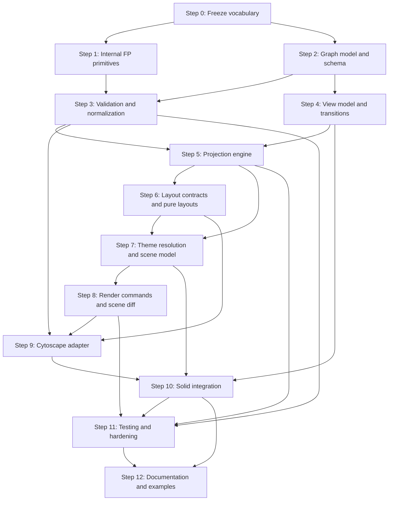

# TODO

This document turns [ARCHITECTURE.md](./ARCHITECTURE.md) into an implementation plan.

The plan is intentionally dependency-aware. Each step lists what must exist before it starts and what it should unlock afterward.

## Working Rules

These rules apply to every implementation step:

- Keep the public API free from third-party FP types.
- Prefer immutable values and pure functions in `src/core`.
- Keep side effects inside renderer and integration boundaries.
- Prefer explicit `Either`-style errors over hidden exceptions in the core.
- Add abstractions only when they are needed by the next concrete step.
- Keep iteration and output ordering deterministic.
- Avoid `any` and unchecked `as T` assertions in the public API and pure core.
- Use Haskell-friendly FP naming internally where practical: `Thunk`, `Maybe`, `Either`, `IO`, and `ReadonlyNonEmptyArray`.

## Dependency Graph

## Step 0: Freeze Vocabulary

Depends on: `ARCHITECTURE.md` sign-off

Status:

- Completed
- Frozen in [DECISIONS.md](./DECISIONS.md)

Produces:

- stable v1 naming for the main public concepts
- stable internal names for staged core values
- clear public vs internal module boundaries

Tasks:

- [x] Confirm internal FP vocabulary uses `Thunk<A>`, `Maybe<A>`, `Either<E, A>`, `IO<A>`, and `ReadonlyNonEmptyArray<A>`.
- [x] Confirm public type names such as `GraphData`, `GraphView`, `GraphTheme`, `LayoutSpec`, and `GraphRenderer`.
- [x] Confirm internal stage names such as `ValidatedGraph`, `ProjectedGraph`, `LaidOutGraph`, `RenderScene`, and `RenderCommand`.
- [x] Decide which types are public exports and which remain internal.
- [x] Decide whether `graph` input is schema-first from day one or introduced incrementally.
- [x] Record naming decisions before code scaffolding starts.

Exit criteria:

- later steps can define files and symbols without renaming churn

## Step 1: Internal FP Primitives

Depends on: Step 0

Produces:

- minimal internal prelude for type-safe, predictable core code

Tasks:

- [ ] Implement a small internal `Brand` utility.
- [ ] Implement a minimal `Either<E, A>` type and helpers with conventional `Left` and `Right` semantics.
- [ ] Implement `Thunk<A>` as the most general suspended synchronous computation type.
- [ ] Implement `Maybe<A>` with conventional `Nothing` and `Just` semantics.
- [ ] Implement `IO<A>` as a semantic effect type over suspended synchronous computation rather than as a synonym for every thunk.
- [ ] Implement only the additional primitives that are immediately needed, likely `ReadonlyNonEmptyArray`, `Dispose`, and `Subscription`.
- [ ] Keep async effect helpers adapter-local unless a concrete core need appears.
- [ ] Decide which helpers are value-level functions versus type-only utilities.
- [ ] Keep this layer intentionally small and local to the package.

Exit criteria:

- later steps can model staged validation, explicit errors, and effect boundaries with familiar FP terminology and without importing third-party FP packages

## Step 2: Graph Model And Schema

Depends on: Step 0

Produces:

- canonical graph input model
- branded identifiers
- optional schema companion and validator contract
- schema-aware node and edge relationships

Tasks:

- [ ] Define `NodeId` and `EdgeId` branded types.
- [ ] Define the public graph input model around `GraphData`.
- [ ] Define `GraphSchema` as an optional companion to `GraphData`, not a replacement for it.
- [ ] Define a library-neutral validator contract for schema-backed runtime validation.
- [ ] Ensure future third-party schema libraries can be added through adapters rather than public API coupling.
- [ ] Decide how much schema-aware `kind -> data` typing is practical in the first pass without weakening type-safety.
- [ ] Add readonly constraints across public graph values.
- [ ] Define public helper constructors only if they materially improve safety.

Exit criteria:

- the project has a stable, renderer-agnostic graph model that later steps can reference

## Step 3: Validation And Normalization

Depends on: Step 1, Step 2

Produces:

- `validateGraph`
- `ValidatedGraph`
- deterministic indexes and lookup tables
- structured validation errors

Tasks:

- [ ] Define validation error types.
- [ ] Validate duplicate node ids.
- [ ] Validate duplicate edge ids.
- [ ] Validate dangling edge references.
- [ ] Normalize defaults and optional fields into stricter internal values.
- [ ] Build deterministic indexes such as `nodeById`, `edgeById`, and adjacency lookup structures.
- [ ] Ensure the output is opaque enough that later stages cannot accidentally bypass validation guarantees.

Exit criteria:

- all core stages after validation can rely on graph integrity without re-checking basic invariants

## Step 4: View Model And Transitions

Depends on: Step 2

Produces:

- public `GraphView`
- internal transition model for exploration state

Tasks:

- [ ] Define the initial public `GraphView` type.
- [ ] Identify invalid state combinations and decide where unions should replace broad optional fields.
- [ ] Define transition events such as focus change, selection change, expand, collapse, and visibility updates.
- [ ] Implement pure transition helpers or reducers.
- [ ] Decide which viewport-related updates belong in the semantic view model and which remain renderer-local.

Exit criteria:

- view changes can be modeled and tested as pure state transitions

## Step 5: Projection Engine

Depends on: Step 3, Step 4

Produces:

- `projectGraph`
- `ProjectedGraph`

Tasks:

- [ ] Define projection inputs and outputs explicitly.
- [ ] Implement focus-driven neighborhood projection.
- [ ] Implement hidden node and edge filtering.
- [ ] Define deterministic ordering rules for projected nodes and edges.
- [ ] Decide how projection failures or empty projections are represented.
- [ ] Keep the projection output renderer-agnostic.

Exit criteria:

- the library can derive a visible subgraph from a validated graph and a view state using pure functions

## Step 6: Layout Contracts And Pure Layouts

Depends on: Step 5

Produces:

- layout contracts
- `LaidOutGraph`
- initial pure layout implementations

Tasks:

- [ ] Define the layout strategy contract.
- [ ] Define portable layout output types.
- [ ] Implement `preset`.
- [ ] Implement `radial`.
- [ ] Implement `breadthfirst`.
- [ ] Decide how layout failures are represented as data.
- [ ] Mark renderer-native layouts as adapter-level concerns rather than core contracts.

Exit criteria:

- projected graphs can be turned into portable layout results without invoking the renderer

## Step 7: Theme Resolution And Scene Model

Depends on: Step 5, Step 6

Produces:

- semantic theme model
- theme resolution functions
- `RenderScene`

Tasks:

- [ ] Define `NodeAppearance` and `EdgeAppearance`.
- [ ] Define the public `GraphTheme` shape.
- [ ] Decide how strongly theme keys are tied to node and edge kinds.
- [ ] Implement pure theme resolution.
- [ ] Define `RenderScene` as the last renderer-agnostic value.
- [ ] Ensure scene contents are sufficient for rendering without leaking renderer-specific semantics.

Exit criteria:

- the core can build a complete scene value from graph, view, layout, and theme

## Step 8: Render Commands And Scene Diff

Depends on: Step 7

Produces:

- `RenderCommand`
- `diffScene`
- deterministic command generation

Tasks:

- [ ] Define the command algebra for renderer work.
- [ ] Define the first-pass minimal diff semantics for scene-to-scene updates.
- [ ] Implement deterministic minimal scene diffing.
- [ ] Keep commands semantic where possible and renderer-specific only where necessary.
- [ ] Define ordering and conflict resolution rules for minimal diff commands.
- [ ] Define command batches and failure surfaces clearly.

Exit criteria:

- the pure core can describe renderer work as data instead of mutating an engine directly

## Step 9: Cytoscape Adapter

Depends on: Step 3, Step 6, Step 8

Produces:

- Cytoscape renderer contract
- command interpreter
- lifecycle and event wiring

Tasks:

- [ ] Define the renderer adapter interface.
- [ ] Implement Cytoscape instance creation and disposal.
- [ ] Implement command interpretation with `cy.batch(...)` where appropriate.
- [ ] Translate semantic theme data into Cytoscape stylesheet data.
- [ ] Decide how Cytoscape-native layouts are surfaced and how their results flow back out.
- [ ] Normalize Cytoscape events into public interaction events.
- [ ] Wrap engine exceptions into adapter-level error values.

Exit criteria:

- a `RenderCommand[]` stream can be safely interpreted against a Cytoscape instance

## Step 10: Solid Integration

Depends on: Step 4, Step 7, Step 9

Produces:

- `Graph` component
- Solid-side lifecycle and update orchestration

Tasks:

- [ ] Define the `Graph` component props around the agreed public model.
- [ ] Mount and dispose the renderer safely in Solid lifecycle hooks.
- [ ] Drive renderer updates from stable derived values rather than ad hoc imperative mutation.
- [ ] Keep controlled-state semantics clear for `graph` and `view`.
- [ ] Expose public callbacks such as node activation and selection change.
- [ ] Decide what low-level renderer escape hatches are intentionally exposed.

Exit criteria:

- Solid users can render and interact with the graph through the public component without touching Cytoscape directly

## Step 11: Testing And Hardening

Depends on: Step 3, Step 5, Step 8, Step 10

Produces:

- confidence in core invariants and renderer integration

Tasks:

- [ ] Add unit tests for validation and normalization.
- [ ] Add unit tests for view transitions.
- [ ] Add unit tests for projection.
- [ ] Add unit tests for layout output invariants.
- [ ] Add unit tests for scene diffing and command generation.
- [ ] Add integration tests for Solid mounting and teardown behavior.
- [ ] Add integration tests for Cytoscape adapter event translation where the environment allows it.
- [ ] Add regression tests for deterministic ordering.

Exit criteria:

- the core pipeline and the Cytoscape integration are covered by tests that match the architectural boundaries

## Step 12: Documentation And Examples

Depends on: Step 10, Step 11

Produces:

- user-facing documentation aligned with the implemented v1

Tasks:

- [ ] Update `README.md` to reflect the toolkit direction instead of the original thin-wrapper framing.
- [ ] Add a minimal example that uses the canonical graph model.
- [ ] Add a focused-neighborhood example.
- [ ] Document the difference between pure core concepts and renderer-specific escape hatches.
- [ ] Document the current limitations and what remains Cytoscape-specific.

Exit criteria:

- the repository communicates the implemented architecture clearly to users and contributors

## Suggested Execution Order

If work starts immediately, the recommended sequence is:

1. Step 0
2. Step 1
3. Step 2
4. Step 3
5. Step 4
6. Step 5
7. Step 6
8. Step 7
9. Step 8
10. Step 9
11. Step 10
12. Step 11
13. Step 12

Some steps can overlap once their prerequisites are complete, but the sequence above is the safest path for keeping the architecture coherent while the codebase is still small.
